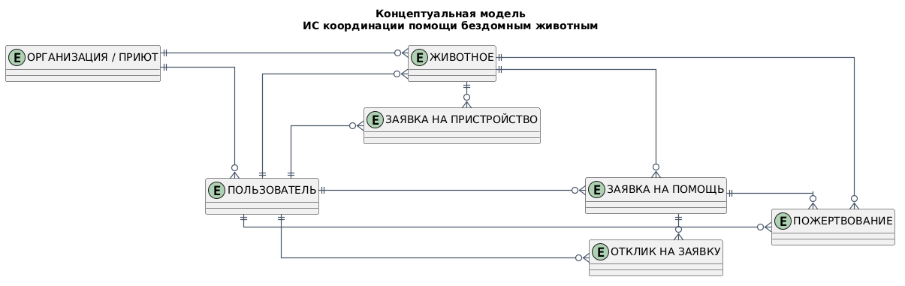
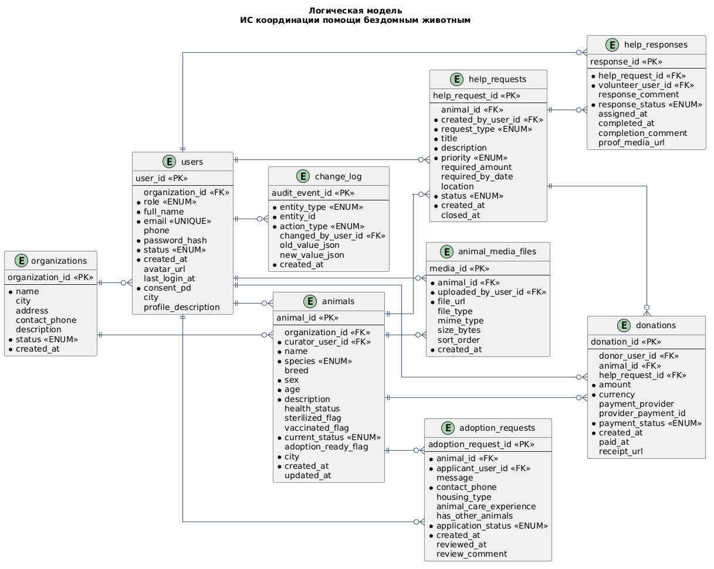
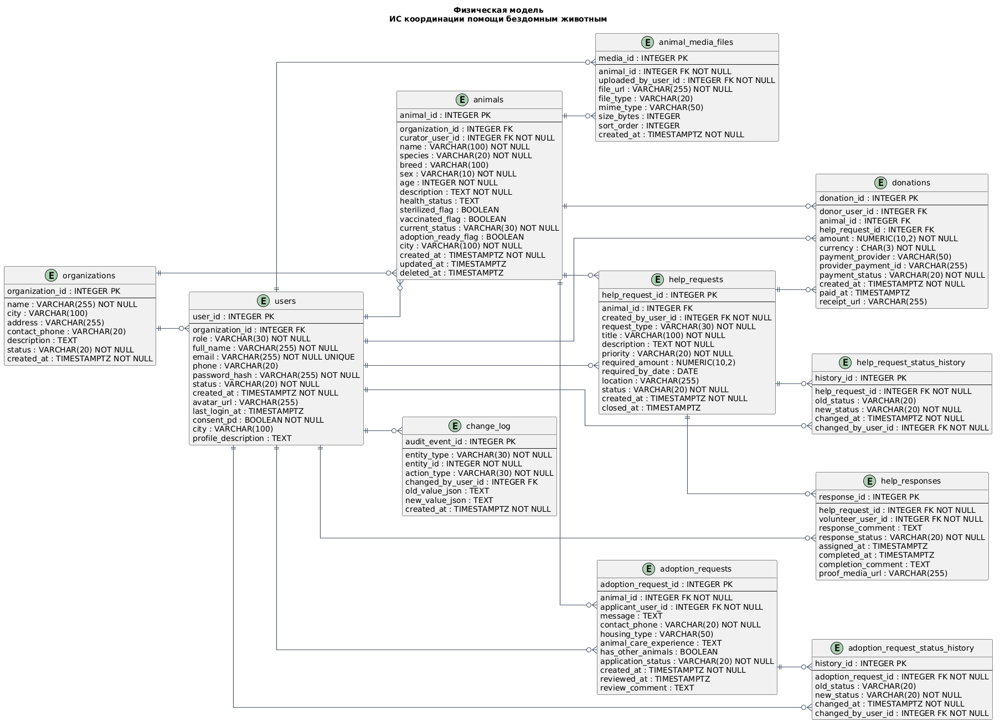

# Уровень 1 — Концептуальная модель

# Уровень 2 — Логическая модель

---

В логической модели я добавила к сущностям поля, связи между ними и отметила ключи (PK, FK) и обязательные поля.

Список сущностей взят из требований: есть пользователи, организации (приюты), животные, заявки на помощь, отклики на заявки, заявки на пристройство, пожертвования и журнал изменений. Это покрывает все основные действия в системе: регистрация, добавление животного, создание заявки, отклик, пристройство и донаты.

Поля с фиксированным набором значений (например, роль пользователя, статус заявки, тип помощи, статус платежа) я сделала как `ENUM`, потому что эти значения заранее известны и не предполагается, что их будут добавлять через интерфейс. Поэтому отдельные таблицы-справочники здесь не нужны.

Связь между пользователем и заявкой на помощь сделана через отдельную сущность `help_responses`, потому что у этой связи есть свои поля (например, комментарий, статус отклика, даты). То есть это не просто связь, а отдельный объект.

Фотографии животных вынесены в отдельную таблицу `animal_media_files`, потому что у одного животного может быть несколько фото, и хранить их в одном поле неправильно.

Также добавлена таблица `change_log`, чтобы фиксировать изменения и действия в системе (например, создание, редактирование, смена статуса). Это нужно для истории и контроля.

# Уровень 3 — Физическая модель

В физической модели я добавила типы данных и ограничения для всех таблиц.

Для идентификаторов (`id`) выбрала тип `INTEGER`, потому что объёмы данных не очень большие и этого достаточно. Внешние ключи сделаны тем же типом, что и первичные, чтобы не было проблем при связях.

Для дат использовала `TIMESTAMPTZ`, чтобы корректно хранить время с учётом часового пояса.
Для денег в таблице `donations` : `NUMERIC(10,2)`, чтобы не было ошибок округления.

Для строк:

- `VARCHAR` : там, где длина примерно понятна (например, email, имя)

- `TEXT` : там, где текст может быть длинным (описания, комментарии)

Из физических решений применены индексы на FK и часто используемые поля, так как в НФТ есть требование по скорости загрузки ключевых страниц — не более 2 секунд для 95% запросов при нагрузке до 50 RPS. Также для `animals` предусмотрено мягкое удаление через поле `deleted_at`, потому что карточка животного связана с заявками, фото, пожертвованиями и историей, и физическое удаление может нарушить целостность данных. Для `change_log` определена стратегия архивирования, так как в НФТ задан срок хранения логов не менее 90 дней.

