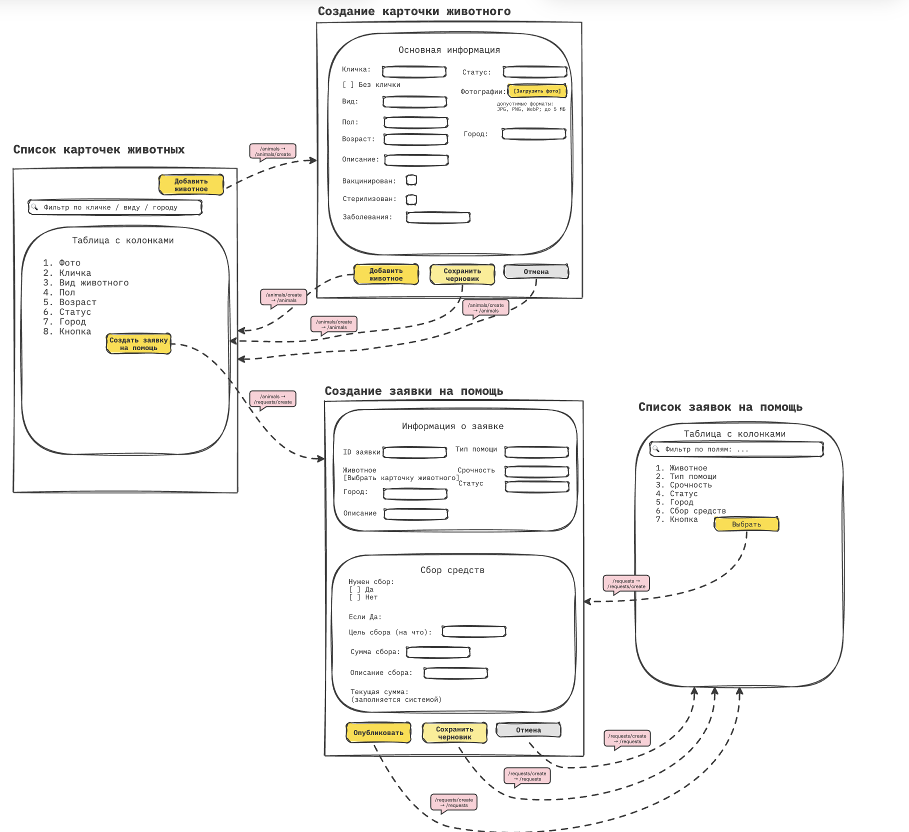

|Экран|Роут|
|-|-|
|Список карточек животных|`/animals`|
|Создание карточки животного|`/animals/create`|
|Список заявок на помощь|`/requests`|
|Создание заявки на помощь|`/requests/create`|

[https://unidraw.io/app/board/82b71e14c24f11d36d93](https://unidraw.io/app/board/82b71e14c24f11d36d93)

# Источники данных (endpoints)

### 1. Карточки животных

**Список карточек животных**

- `GET /api/animals` — получить список карточек животных

**Создание карточки животного**

- `POST /api/animals` — создать карточку животного

- `POST /api/animals/{animalId}/photos` — загрузить фотографию

- `PATCH /api/animals/{animalId}` — изменить карточку животного

- `PATCH /api/animals/{animalId}/status` — изменить статус животного

- `GET /api/animals/{animalId}` — получить карточку животного

- `DELETE /api/animals/{animalId}/photos/{photoId}` — удалить фотографию

- `DELETE /api/animals/{animalId}` — удалить карточку животного

### 2. Заявки на помощь

**Список заявок на помощь**

- `GET /api/requests` — получить список заявок

**Создание заявки на помощь**

- `POST /api/requests` — создать заявку

- `GET /api/requests/{requestId}` — получить карточку заявки

- `PATCH /api/requests/{requestId}` — изменить заявку

- `PATCH /api/requests/{requestId}/status` — изменить статус заявки

- `DELETE /api/requests/{requestId}` — удалить заявку

---

